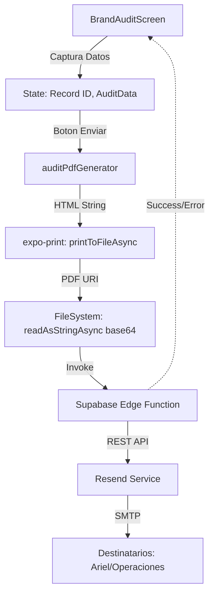

# ADR 005: Arquitectura del Sistema de Auditoría de Marcas Local-First

## Fecha: 2026-05-04
## Estado: Aprobado
## Responsable: Antigravity (AI Architect)

---

## 1. Contexto y Problema
La aplicación requería una funcionalidad de **Auditoría de Marcas** que permitiera a los operarios (Almacén/Tienda) validar el stock físico contra el sistema. El flujo debía cumplir con:
1.  **Diferenciación de Insumos**: Soporte para conteo manual (teclado) y conteo vía escáner (cámara).
2.  **Integración con Backend**: Generación de un reporte PDF comparativo y envío automático vía correo electrónico (Supabase Edge Functions + Resend).
3.  **Restricción Operativa**: La auditoría **no debe** modificar el stock maestro (SRP - Single Responsibility Principle), sino actuar como un mecanismo de reporte para ajustes administrativos posteriores.

## 2. Decisiones Arquitecturales

### 2.1. Modelo de Datos de Auditoría: "Diferencia" vs "Total"
**Decisión:** Se optó por un modelo basado en **Diferencias Relativas** en lugar de totales físicos.
*   **Racional:** Históricamente, el equipo de administración procesa "ajustes de inventario". Solicitar al usuario la diferencia directamente (ej: -2 si faltan unidades) reduce la carga cognitiva de cálculo en el servidor y alinea el reporte con la lógica de auditoría clásica de Mascotify.
*   **Implementación:** 
    *   **Manual:** El usuario ingresa `ΔV`.
    *   **Escáner:** El sistema calcula `ΔV = ScannedCount - SystemStock`.

### 2.2. Motor de Generación de Reportes (PDF Strategy)
**Decisión:** Uso de `expo-print` con plantillas **HTML/CSS dinámicas** en lugar de generadores de PDF binarios (como jsPDF).
*   **Racional:** El HTML permite un control preciso sobre el diseño (CSS Flexbox/Grid), permitiendo imitar la visual de una hoja de cálculo (Google Sheets) solicitada por el usuario. Además, facilita la incrustación de imágenes de productos vía URLs directas o Base64.
*   **Componente:** `auditPdfGenerator.ts` encapsula la lógica de renderizado, separando la preocupación de la vista (UI) de la representación documental.

### 2.3. Robustez en Dependencias (FileSystem Encoding)
**Decisión:** Sustitución de enums tipados por **Literales de Cadena (`'base64'`)**.
*   **Problema:** Inconsistencias en las exportaciones de `expo-file-system` (SDK 54+) generaban errores de compilación al intentar acceder a `EncodingType`.
*   **Racional:** Las APIs de bajo nivel de Expo aceptan literales. Al usar `'base64'`, garantizamos que la aplicación compile y funcione sin importar las micro-variaciones en las definiciones de tipos de la librería.

### 2.4. Estrategia de Error Propagation (Observabilidad)
**Decisión:** Implementación de un **Middleware de Captura de Errores** en el cliente para respuestas 500 de Edge Functions.
*   **Racional:** Por defecto, las llamadas a Edge Functions pueden fallar silenciosamente o con mensajes genéricos de red. Se modificó el handler para inspeccionar el cuerpo del JSON de error (`data.error`), permitiendo distinguir entre fallos de conectividad y errores de lógica de negocio (ej: fallo en la API de Resend).

## 3. Consecuencias
*   **Positivas:**
    *   Alineación visual total entre la App y los reportes administrativos.
    *   Reducción de errores humanos al estandarizar la entrada de "Diferencias".
    *   Mayor facilidad para diagnosticar problemas en la nube desde el dispositivo móvil.
*   **Negativas:**
    *   Dependencia de conectividad para el paso final de "Envío" (mitigado por la persistencia local de la marca como auditada).

## 4. Diagrama de Flujo de Datos

---
*Documento generado automáticamente por Mascotify AI Architect.*
